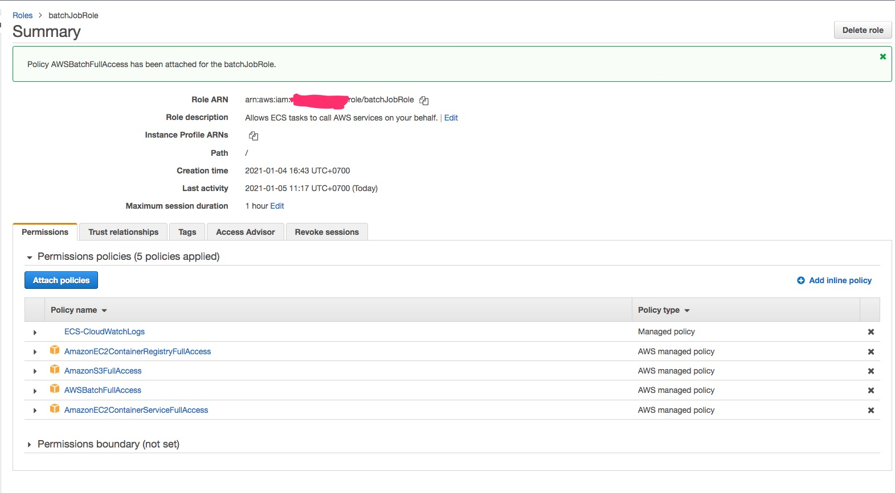
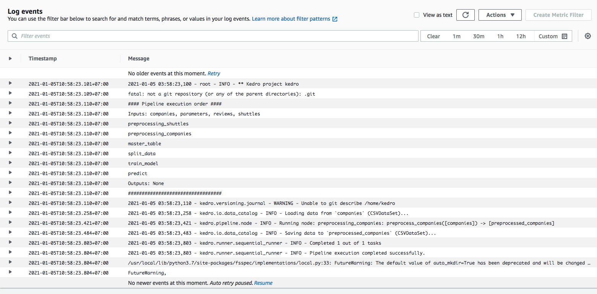
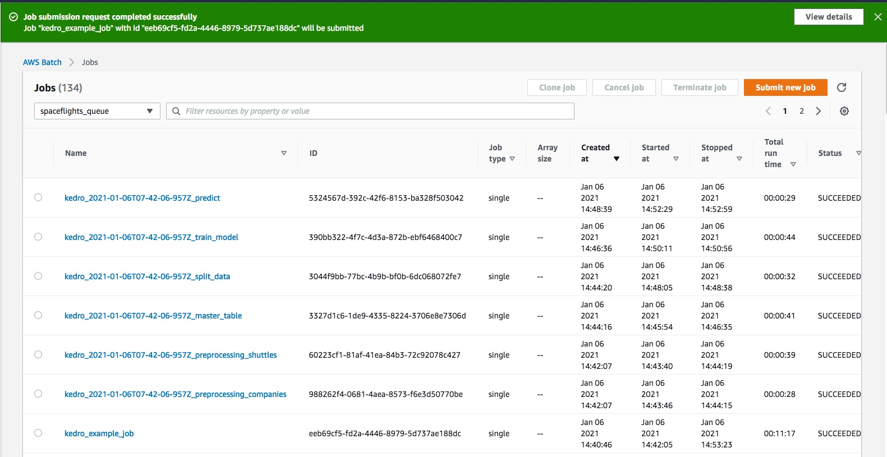
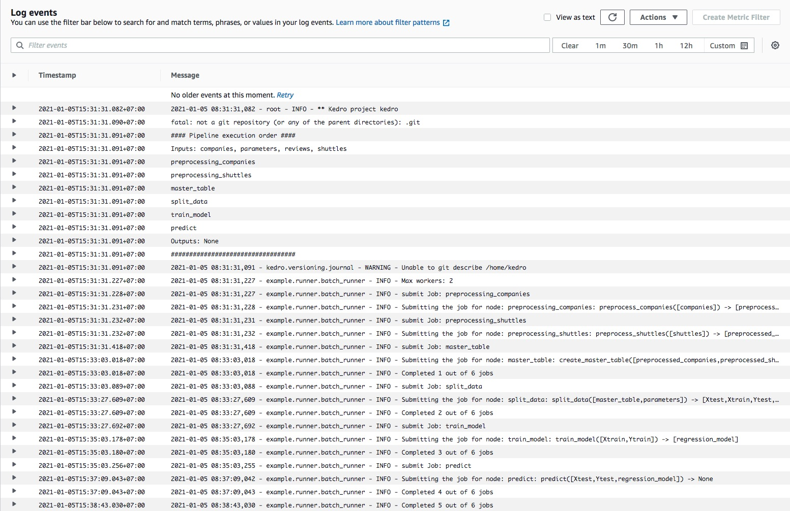

# Kedro AWS Batch
    Run a Kedro Project on AWS Batch

### Prerequisites
+ Docker
+ Kedro 0.16.6
+ ECR, S3 & AWS Batch
+ scikit-learn 0.23.0
+ pickle5 0.0.11


### Build
+ Build image
    ```
    example$ ./scripts/build.sh
    ```

+ Push image into ECR
    ```
    docker tag [image uri]
    docker push [image uri]
    ```

+ Create IAM role
    ```
    Name the newly-created IAM role `batchJobRole`.
    The policy (step 3) should be added `AmazonS3FullAccess`
    ```

+ Create AWS Batch compute environment
    ```
    Create a managed, on-demand one named `spaceflights_env` and let it choose to create new service and instance roles
    ```

+ Create AWS Batch job queue
    ```
    Create a queue named `spaceflights_queue`, connected to your newly created compute environment `spaceflights_env`, and give it `Priority` 1.
    ```

+ Create AWS Batch job definition
    ```
    Create a job definition named `kedro_run`, assign it the newly created `batchJobRole` IAM role, the container image you’ve packaged above, execution timeout of 300s and 2000MB of memory
    ```

+ Run Kedro node(Run Jobs)
    ```
    Command: kedro run --node preprocessing_companies
    ```

+ Submit AWS Batch jobs(Run Jobs)
    ```
    Command: kedro run --env aws_batch --runner example.runner.AWSBatchRunner
    ```


### Issues
+ Error: ECR registry auth
    ```
    ResourceInitializationError: unable to pull secrets or registry auth:
    execution resource retrieval failed: unable to retrieve ecr registry auth:
    service call has been retried 1 time(s):
    AccessDeniedException: User: arn:aws:sts::783560535431:assumed-rol...

    ResourceInitializationError: unable to pull secrets or registry auth:
    execution resource retrieval failed:
    unable to retrieve ecr registry auth: service call has been retried 1 time(s):
    RequestError: send request failed caused by: Post https://api.ecr....
    ```

    Fixed: add permission ECS for batchJobRole


+ Error: Cloudwatch log stream
    ```
    ResourceInitializationError: failed to validate logger args:
    create stream has been retried 1 times: failed to create Cloudwatch log stream:
    AccessDeniedException: User: arn:aws:sts::783560535431:assumed-role/batchJobRole/986cca09ac1748c08b77360b92e314...
    ```

    Fixed: add permission CloudWatch for batchJobRole
    ```
    ECS-CloudWatchLogs
    https://docs.aws.amazon.com/AmazonECS/latest/developerguide/using_cloudwatch_logs.html

    {
        "Version": "2012-10-17",
        "Statement": [
            {
                "Effect": "Allow",
                "Action": [
                    "logs:CreateLogGroup",
                    "logs:CreateLogStream",
                    "logs:PutLogEvents",
                    "logs:DescribeLogStreams"
                ],
                "Resource": [
                    "arn:aws:logs:*:*:*"
                ]
            }
        ]
    }
    ```


+ Error: SubmitJob
    ```
    botocore.exceptions.ClientError: An error occurred (AccessDeniedException) when
    calling the SubmitJob operation:
    User: arn:aws:sts::783560535431:assumed-role/batchJobRole/27a6c01f23ec42dfac5d20d539eb48bf is not authorized to perform:
    batch:SubmitJob on resource: arn:aws:batch:ap-southeast-1:783560535431:job-definition/kedro_run
    ```

    Fixed: add permission `AWSBatchFullAccess` for batchJobRole


+ BatchJobRole



### Results
+ Kedro run Node
    


+ Kedro Example Job
    

+ Kedro Job Log
    


### References
+ [Deployment on AWS Batch](https://kedro.readthedocs.io/en/0.16.6/10_deployment/07_aws_batch.html)
+ [CloudWatch](https://docs.aws.amazon.com/AmazonECS/latest/developerguide/using_cloudwatch_logs.html)
+ [BotoCore Client Error](https://stackoverflow.com/questions/61976547/botocore-exceptions-clienterror-an-error-occurred-accessdeniedexception)
+ [Getting started with AWS Batch](https://medium0.com/weareservian/getting-started-with-aws-batch-3442446fc62)
+ [Send ECS Container Logs to CloudWatch Logs](https://aws.amazon.com/blogs/devops/send-ecs-container-logs-to-cloudwatch-logs-for-centralized-monitoring/)